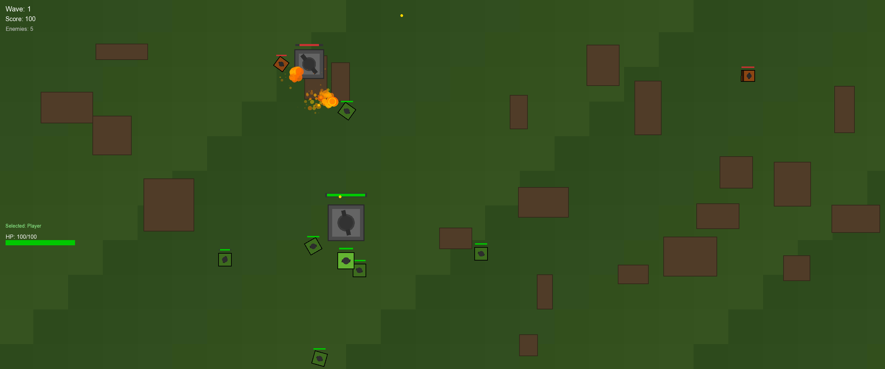
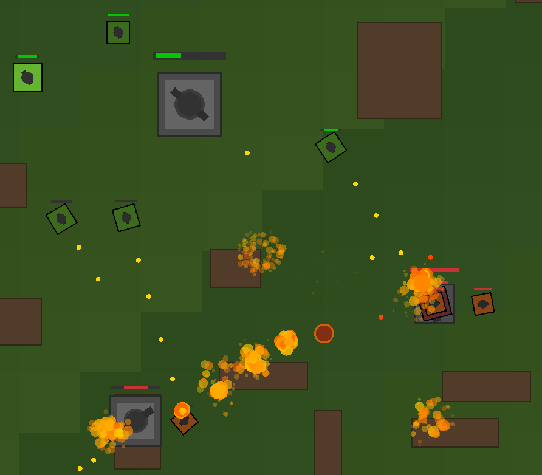
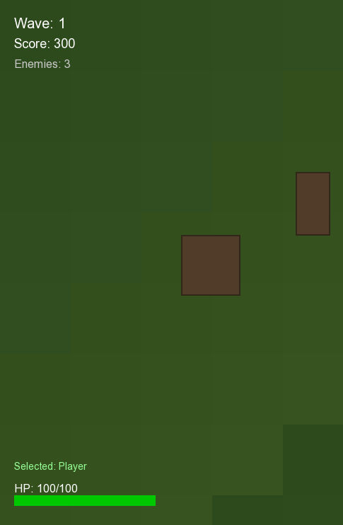
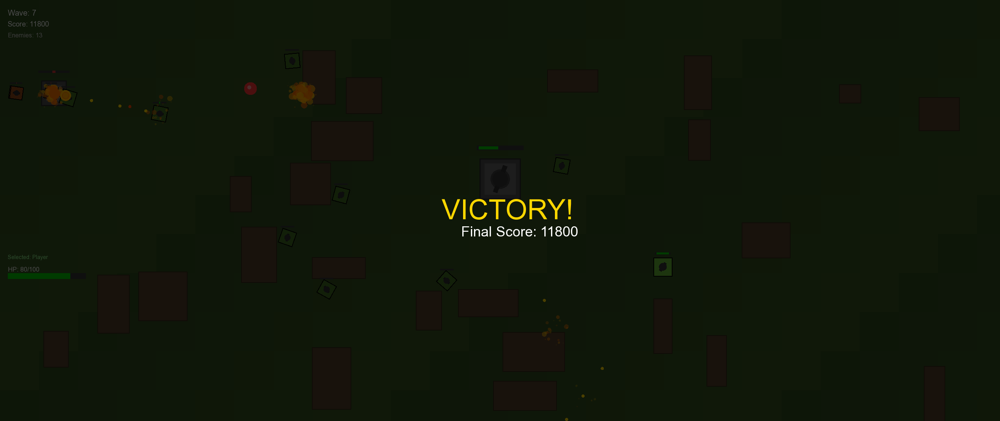
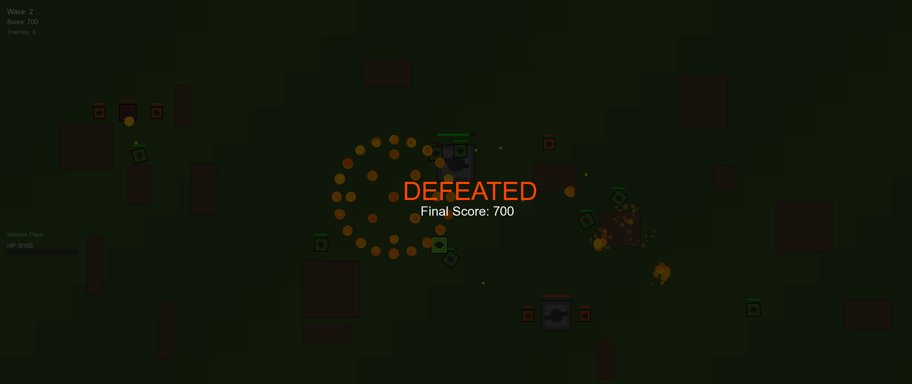

# StratTank - 2D Strategy Tank Game

<div align="center">
  
  <p><em>A top-down strategy tank game where you command your forces against enemy waves</em></p>
</div>

---

## Table of Contents

- [Overview](#overview)
- [Features](#features)
- [Building](#building)
  - [Linux / macOS](#linux--macos)
  - [Windows (CMake)](#windows-cmake)
- [Gameplay](#gameplay)
  - [Controls](#controls)
  - [Game Entities](#game-entities)
  - [Wave System](#wave-system)
- [Screenshots](#screenshots)
- [Architecture](#architecture)
  - [Class Hierarchy](#class-hierarchy)
  - [C++ Concepts](#c-concepts-used)
  - [Design Patterns](#design-patterns)
- [Project Structure](#project-structure)
- [License](#license)

---

## Overview

**StratTank** is a 2D top-down strategy tank game built in C++ using SFML (Simple and Fast Multimedia Library). Command your tank alongside allied units to battle increasingly difficult waves of enemies through tactical positioning, strategic targeting, and coordinated attacks.

**Author:** Aaryan Pawar  
**License:** MIT License  
**Build Systems:** CMake (cross-platform), Makefile (Linux/macOS)  
**C++ Standard:** C++17  
**Dependencies:** SFML 3.0

---

## Features

- **Player Tank Control** - WASD movement with mouse aiming and shooting
- **Ally Commands** - Issue move/attack orders to allied tanks with right-click
- **6 Allied Tanks** - 2 guarding base, 4 mobile support units
- **Multiple Enemy Types** - Light tanks, heavy tanks, and fortified positions
- **Wave-Based Progression** - 7 waves with escalating difficulty
- **Strategic Gameplay** - Randomly generated barriers for tactical combat
- **Visual Effects** - Particle systems for explosions, muzzle flashes, and smoke
- **HUD System** - Health, wave number, score, enemy base status
- **Dynamic World** - Adapts to any screen resolution
- **Fort Bombs** - Area damage with visual warning indicators

---

## Building

### Prerequisites

- **C++17 compatible compiler** (GCC, Clang, MSVC)
- **SFML 3.0** (Graphics, Audio, Window, System modules)

#### Installing SFML

**Ubuntu/Debian:**
```bash
sudo apt-get install libsfml-dev
```

**Fedora:**
```bash
sudo dnf install SFML-devel
```

**Arch Linux:**
```bash
sudo pacman -S sfml
```

**macOS (Homebrew):**
```bash
brew install sfml
```

**Windows:** Download from [SFML Downloads](https://www.sfml-dev.org/download.php)

---

### Linux / macOS

#### Option 1: Makefile (Recommended)

```bash
# Clone the repository
git clone https://github.com/yourusername/StratTank.git
cd StratTank

# Build with make
make

# Run the game
./StratTank

# Clean build artifacts
make clean
```

#### Option 2: CMake

```bash
# Clone the repository
git clone https://github.com/yourusername/StratTank.git
cd StratTank

# Create and enter build directory
mkdir -p build && cd build

# Generate build files
cmake ..

# Build the project
cmake --build . --config Release

# Run the game
./StratTank
```

---

### Windows (CMake)

#### Using Visual Studio with CMake

1. Open Visual Studio
2. Select "Clone a repository"
3. Enter: `https://github.com/yourusername/StratTank.git`
4. Wait for CMake to configure
5. Press `Ctrl+Shift+B` to build
6. Press `F5` to run

#### Using Command Line

```bash
# Clone the repository
git clone https://github.com/yourusername/StratTank.git
cd StratTank

# Create build directory
mkdir build && cd build

# Generate build files
cmake ..

# Build the project
cmake --build . --config Release

# Run the game
.\Release\StratTank.exe
```

#### DLL Dependencies

If the game fails to start, ensure these DLLs are in the same directory as `StratTank.exe`:

| DLL | Description |
|-----|-------------|
| `libsfml-graphics-3.dll` | Graphics module |
| `libsfml-window-3.dll` | Window module |
| `libsfml-system-3.dll` | System module |
| `libsfml-audio-3.dll` | Audio module |
| `libgcc_s_seh-1.dll` | GCC runtime |
| `libstdc++-6.dll` | C++ standard library |
| `libwinpthread-1.dll` | POSIX threads |

These are typically found in your compiler's `bin` directory (e.g., `C:\msys64\ucrt64\bin` for MSYS2).

---

## Gameplay

### Controls

| Key | Action |
|-----|--------|
| `W` `A` `S` `D` | Move player tank |
| `Mouse Move` | Aim turret |
| `Left Click` | Shoot |
| `Right Click` | Command selected ally / Select ally |
| `1` `2` `3` | Select ally tank 1, 2, or 3 |
| `4` `5` `6` | Select additional ally tanks |
| `Space` | Select all allies |
| `Tab` | Cycle through allies |
| `Shift + Right Click` | Command all allies |
| `Escape` | Pause game |

### Game Entities

#### Player Tank
- **Health:** 100 HP
- **Speed:** 150 units/sec
- **Damage:** 15 per shot
- **Fire Rate:** 3.0 shots/sec
- **Color:** Olive green

#### Ally Tanks
- **Health:** 60 HP
- **Speed:** 120 units/sec
- **Damage:** 12 per shot
- **Fire Rate:** 3.0 shots/sec
- **Color:** Darker green

#### Enemy Types

| Type | Health | Speed | Damage | Fire Rate |
|------|--------|-------|--------|-----------|
| **Light Tank** | 30 HP | 120 | 10 | 2.5/sec |
| **Heavy Tank** | 80 HP | 60 | 20 | 1.5/sec |
| **Fort** | 200 HP | 0 | 25 | 1.5/sec |

#### Special Elements

- **Health Pickups (Hearts):** Spawn every 10 seconds, heal 25 HP
- **Fort Bombs:** 200px radius, 500 damage, 10-second cooldown

### Wave System

| Wave | Light Tanks | Heavy Tanks | Forts |
|------|-------------|-------------|-------|
| 1 | 3 | 0 | 0 |
| 2 | 2 | 1 | 0 |
| 3 | 4 | 2 | 0 |
| 4 | 3 | 2 | 2 |
| 5 | 5 | 3 | 2 |
| 6 | 6 | 4 | 3 |
| 7 | 8 | 5 | 4 |

---

## Screenshots

<div align="center">

### Main Gameplay

*The battlefield with player tank, allies, and incoming enemies*

### Combat

*Strategic combat against enemy tanks and forts*

### HUD Display

*In-game HUD showing health, wave number, score, and enemy base status*

### Victory Screen

*Victory screen after clearing all waves*

### Defeat Screen

*Game over screen when the player is defeated*

</div>

---

## Architecture

### Class Hierarchy

```
Entity (Abstract Base)
├── Tank (Abstract)
│   ├── PlayerTank
│   ├── AllyTank
│   └── EnemyTank
├── Fort
├── Projectile
└── Heart
```

### C++ Concepts Used

- **Inheritance:** Base `Entity` class with derived game objects
- **Polymorphism:** Virtual `update()` and `render()` methods
- **Smart Pointers:** `std::unique_ptr` for automatic memory management
- **Function Objects:** `std::function` for callbacks (projectiles, bombs)
- **Enums:** `enum class` for type-safe game states and entity types
- **Standard Containers:** `std::vector`, `std::list`, `std::function`

### Design Patterns

- **Game Loop:** Update/render cycle with delta time
- **Observer/Callback:** Decoupled projectile and bomb event handling
- **Factory:** `WaveManager` spawns enemies dynamically
- **RAII:** Smart pointers ensure resource cleanup

### Key Implementation Files

| File | Purpose |
|------|---------|
| `Game.cpp` | Main game loop, state management, collision detection |
| `Tank.cpp` | Base tank movement, steering, obstacle avoidance |
| `AllyTank.cpp` | Ally AI: auto-targeting, defending, wandering |
| `EnemyTank.cpp` | Enemy AI: flanking, fleeing, patrol behavior |
| `Fort.cpp` | Fort bomb system, rotating turret AI |
| `WaveManager.cpp` | Wave configuration and enemy spawning |
| `ParticleSystem.cpp` | Visual effects (explosions, muzzle flash, smoke) |
| `HUD.cpp` | User interface rendering |
| `WorldConfig.cpp` | Dynamic world bounds based on window size |

---

## License

This project is licensed under the MIT License - see the [LICENSE](LICENSE) file for details.

---

<div align="center">
  <p>Built with C++17 and SFML</p>
</div>
